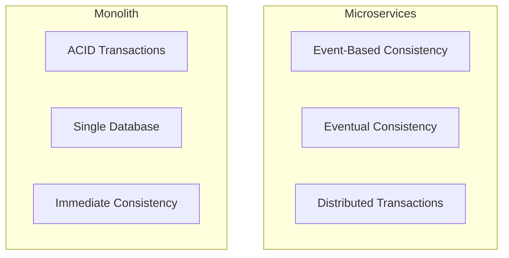
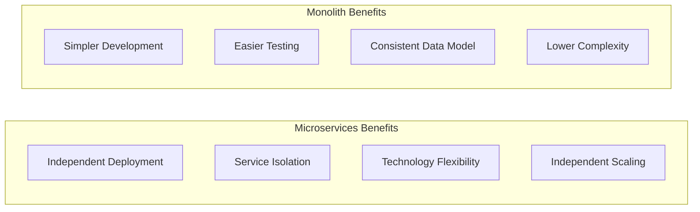
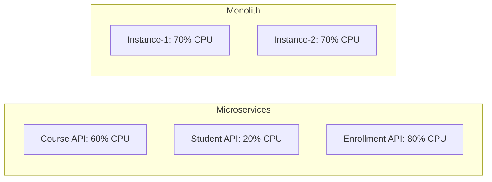
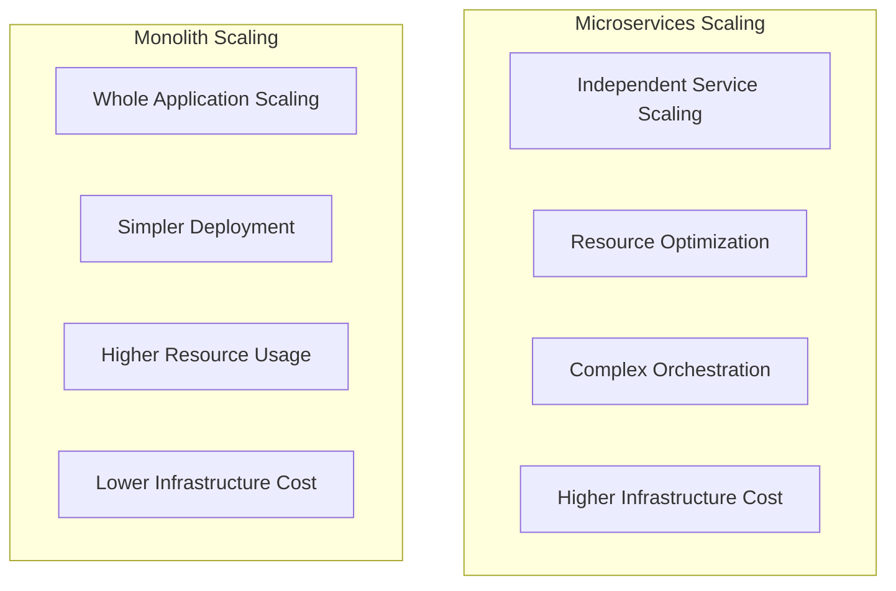

```mermaid
graph TB
    subgraph "Microservices"
        EventBus[Event-Based Consistency]
        Eventual[Eventual Consistency]
        Distributed[Distributed Transactions]
    end

    subgraph "Monolith"
        ACID[ACID Transactions]
        Single[Single Database]
        Immediate[Immediate Consistency]
    end
```

```mermaid
graph LR
subgraph "Microservices Benefits"
MS1[Independent Deployment]
MS2[Service Isolation]
MS3[Technology Flexibility]
MS4[Independent Scaling]
end

    subgraph "Monolith Benefits"
        M1[Simpler Development]
        M2[Easier Testing]
        M3[Consistent Data Model]
        M4[Lower Complexity]
    end
```

```mermaid
graph LR
    subgraph "Microservices"
        MS1[Course API: 60% CPU]
        MS2[Student API: 20% CPU]
        MS3[Enrollment API: 80% CPU]
    end

    subgraph "Monolith"
        M1[Instance-1: 70% CPU]
        M2[Instance-2: 70% CPU]
    end
```

```mermaid
graph TB
    subgraph "Microservices Scaling"
        MS1[Independent Service Scaling]
        MS2[Resource Optimization]
        MS3[Complex Orchestration]
        MS4[Higher Infrastructure Cost]
    end

    subgraph "Monolith Scaling"
        M1[Whole Application Scaling]
        M2[Simpler Deployment]
        M3[Higher Resource Usage]
        M4[Lower Infrastructure Cost]
    end
```
