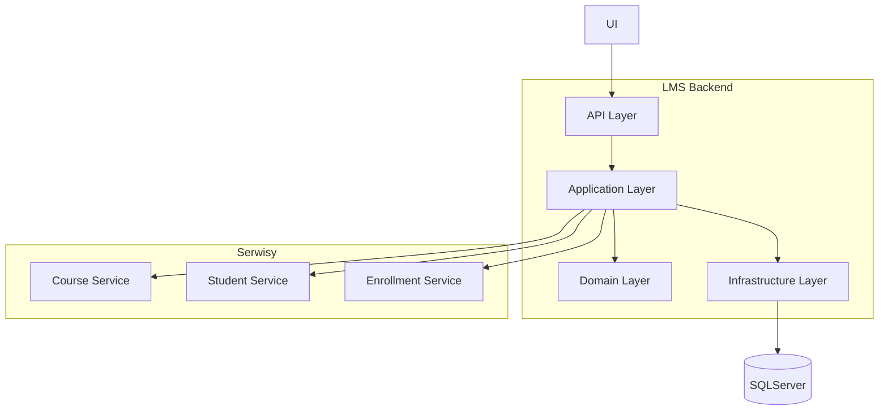
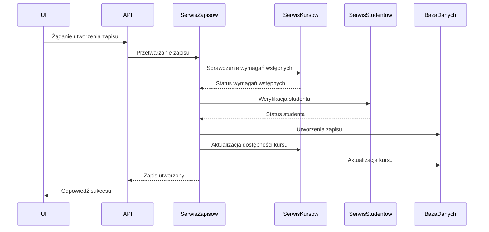
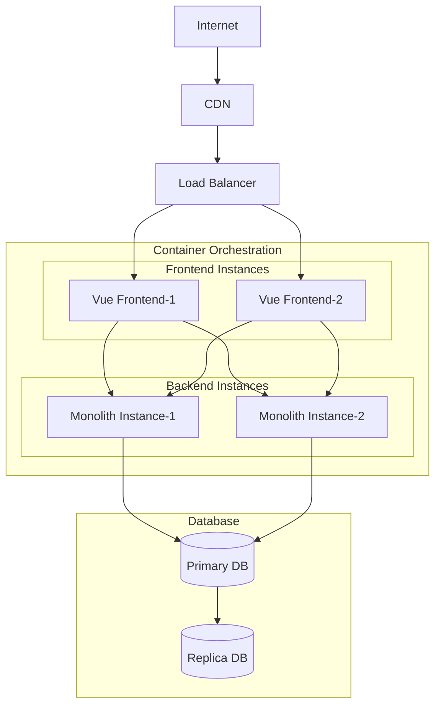
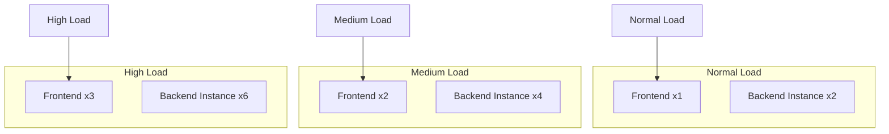

```mermaid
graph TB
Client[UI]

    subgraph "LMS Backend"
        API[API Layer]
        AppLayer[Application Layer]
        Domain[Domain Layer]
        DataLayer[Infrastructure Layer]
    end

    Database[(SQLServer)]

    Client --> API
    API --> AppLayer
    AppLayer --> Domain
    AppLayer --> DataLayer
    DataLayer --> Database

    subgraph "Serwisy"
        CourseService[Course Service]
        StudentService[Student Service]
        EnrollmentService[Enrollment Service]
    end

    AppLayer --> CourseService
    AppLayer --> StudentService
    AppLayer --> EnrollmentService
```

Data Flow (enrollment process)

```mermaid
sequenceDiagram
    participant UI
    participant API
    participant SerwisZapisow
    participant SerwisKursow
    participant SerwisStudentow
    participant BazaDanych

    UI->>API: Żądanie utworzenia zapisu
    API->>SerwisZapisow: Przetwarzanie zapisu
    SerwisZapisow->>SerwisKursow: Sprawdzenie wymagań wstępnych
    SerwisKursow-->>SerwisZapisow: Status wymagań wstępnych
    SerwisZapisow->>SerwisStudentow: Weryfikacja studenta
    SerwisStudentow-->>SerwisZapisow: Status studenta
    SerwisZapisow->>BazaDanych: Utworzenie zapisu
    SerwisZapisow->>SerwisKursow: Aktualizacja dostępności kursu
    SerwisKursow->>BazaDanych: Aktualizacja kursu
    SerwisZapisow-->>API: Zapis utworzony
    API-->>UI: Odpowiedź sukcesu
```

Deployment arch

```mermaid
graph TB
    subgraph "Container Orchestration"
        subgraph "Frontend Instances"
            FE1[Vue Frontend-1]
            FE2[Vue Frontend-2]
        end

        subgraph "Backend Instances"
            BE1[Monolith Instance-1]
            BE2[Monolith Instance-2]
        end
    end

    subgraph "Database"
        DB1[(Primary DB)]
        DB2[(Replica DB)]
    end

    LB[Load Balancer]
    CDN[CDN]

    Internet[Internet] --> CDN
    CDN --> LB
    LB --> FE1 & FE2
    FE1 & FE2 --> BE1 & BE2
    BE1 & BE2 --> DB1
    DB1 --> DB2
```

Scalling Scenarios:

```mermaid
graph TB
    subgraph "Normal Load"
        FE1[Frontend x1]
        BE1[Backend Instance x2]
    end

    subgraph "Medium Load"
        FE2[Frontend x2]
        BE2[Backend Instance x4]
    end

    subgraph "High Load"
        FE3[Frontend x3]
        BE3[Backend Instance x6]
    end

    NL[Normal Load] --> FE1
    ML[Medium Load] --> FE2
    HL[High Load] --> FE3
```
