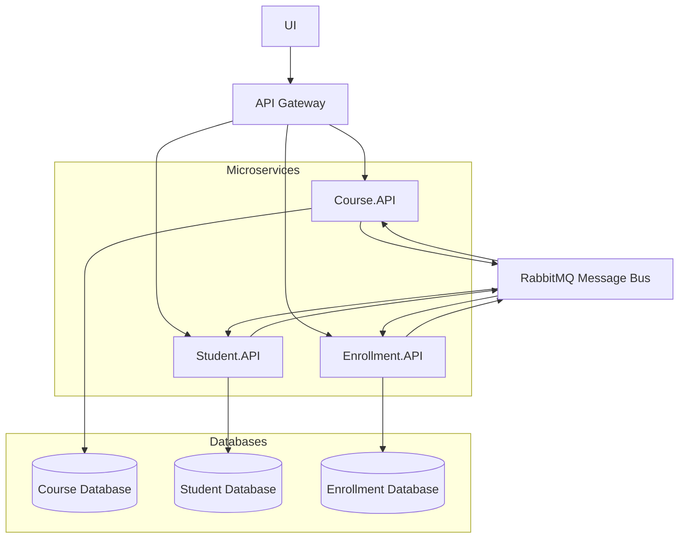
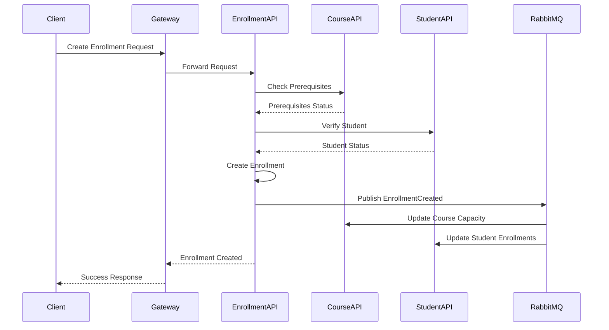
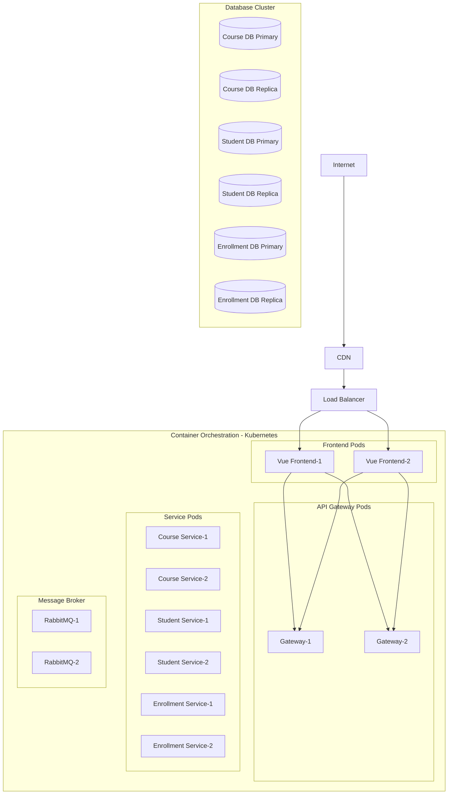
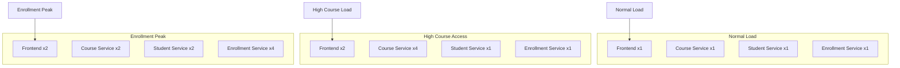

Architecture:

```mermaid
graph TB
    Client[UI]
    Gateway[API Gateway]
    RabbitMQ[RabbitMQ Message Bus]

    subgraph Microservices
        CourseAPI[Course.API]
        StudentAPI[Student.API]
        EnrollmentAPI[Enrollment.API]
    end

    subgraph Databases
        CourseDB[(Course Database)]
        StudentDB[(Student Database)]
        EnrollmentDB[(Enrollment Database)]
    end

    Client --> Gateway
    Gateway --> CourseAPI
    Gateway --> StudentAPI
    Gateway --> EnrollmentAPI

    CourseAPI --> CourseDB
    StudentAPI --> StudentDB
    EnrollmentAPI --> EnrollmentDB

    CourseAPI --> RabbitMQ
    StudentAPI --> RabbitMQ
    EnrollmentAPI --> RabbitMQ

    RabbitMQ --> CourseAPI
    RabbitMQ --> StudentAPI
    RabbitMQ --> EnrollmentAPI
```

Data Flow (enrollment process)

```mermaid
sequenceDiagram
    participant Client
    participant Gateway
    participant EnrollmentAPI
    participant CourseAPI
    participant StudentAPI
    participant RabbitMQ

    Client->>Gateway: Create Enrollment Request
    Gateway->>EnrollmentAPI: Forward Request
    EnrollmentAPI->>CourseAPI: Check Prerequisites
    CourseAPI-->>EnrollmentAPI: Prerequisites Status
    EnrollmentAPI->>StudentAPI: Verify Student
    StudentAPI-->>EnrollmentAPI: Student Status
    EnrollmentAPI->>EnrollmentAPI: Create Enrollment
    EnrollmentAPI->>RabbitMQ: Publish EnrollmentCreated
    RabbitMQ->>CourseAPI: Update Course Capacity
    RabbitMQ->>StudentAPI: Update Student Enrollments
    EnrollmentAPI-->>Gateway: Enrollment Created
    Gateway-->>Client: Success Response
```

Deployment Arch:

```mermaid
graph TB
    subgraph "Container Orchestration - Kubernetes"
        subgraph "Frontend Pods"
            FE1[Vue Frontend-1]
            FE2[Vue Frontend-2]
        end

        subgraph "API Gateway Pods"
            GW1[Gateway-1]
            GW2[Gateway-2]
        end

        subgraph "Service Pods"
            CS1[Course Service-1]
            CS2[Course Service-2]
            SS1[Student Service-1]
            SS2[Student Service-2]
            ES1[Enrollment Service-1]
            ES2[Enrollment Service-2]
        end

        subgraph "Message Broker"
            RMQ1[RabbitMQ-1]
            RMQ2[RabbitMQ-2]
        end
    end

    subgraph "Database Cluster"
        CDB1[(Course DB Primary)]
        CDB2[(Course DB Replica)]
        SDB1[(Student DB Primary)]
        SDB2[(Student DB Replica)]
        EDB1[(Enrollment DB Primary)]
        EDB2[(Enrollment DB Replica)]
    end

    LB[Load Balancer]
    CDN[CDN]

    Internet[Internet] --> CDN
    CDN --> LB
    LB --> FE1 & FE2
    FE1 & FE2 --> GW1 & GW2
```

Scalling Scenarios

```mermaid
graph TB
    subgraph "Normal Load"
        FE1[Frontend x1]
        CS1[Course Service x1]
        SS1[Student Service x1]
        ES1[Enrollment Service x1]
    end

    subgraph "High Course Access"
        FE2[Frontend x2]
        CS2[Course Service x4]
        SS2[Student Service x1]
        ES2[Enrollment Service x1]
    end

    subgraph "Enrollment Peak"
        FE3[Frontend x2]
        CS3[Course Service x2]
        SS3[Student Service x2]
        ES3[Enrollment Service x4]
    end

    NL[Normal Load] --> FE1
    HL[High Course Load] --> FE2
    EP[Enrollment Peak] --> FE3
```
